# AWS Configuration for Jenkins

## We will be setting up a Jenkins, in the end we shoud have:

1. An AWS EC2 instance running Ubuntu 22.04 LTS
2. Jenkins setup running on Docker

### To setup the environment, you need to have an AWS EC2 instance configured as follows:

1. Log in to your AWS account
1. After you are logged in, select the **Services** button:
1. Select **Compute**
1. Select **EC2** for a Virtual Private Server in the cloud<br/>
   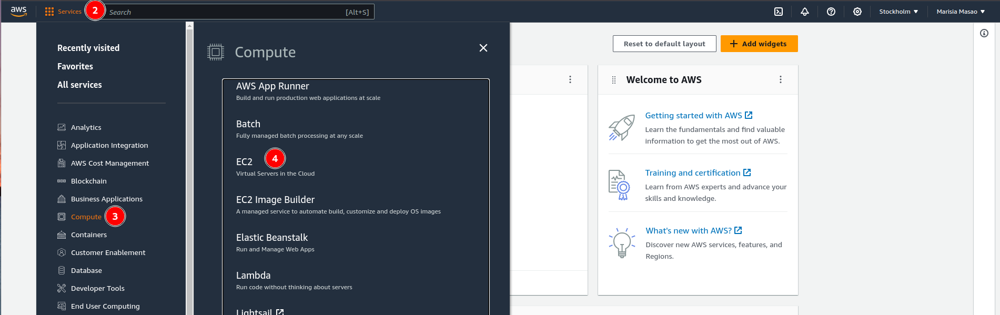
   
1. Launch a new instance by selecting **Launch Instances**:
   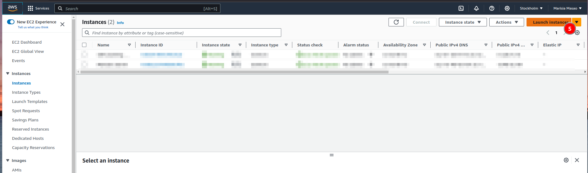
1. Fill in the **Name** of your server, and select the **Amazon Linux** image
   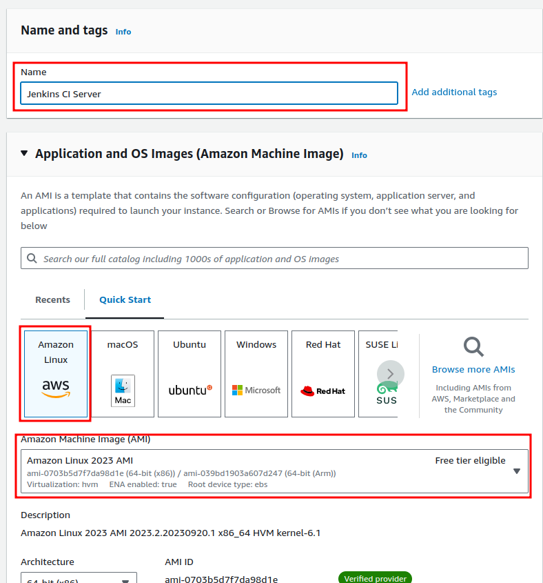
1. Leave the **Instance Type** section as is
1. In the **Key Pair** section, select **Create key pair** fill in the details, and you will be prompted to download the key .pem file, and keep it in a Folder where it's easily accessible from your terminal.
   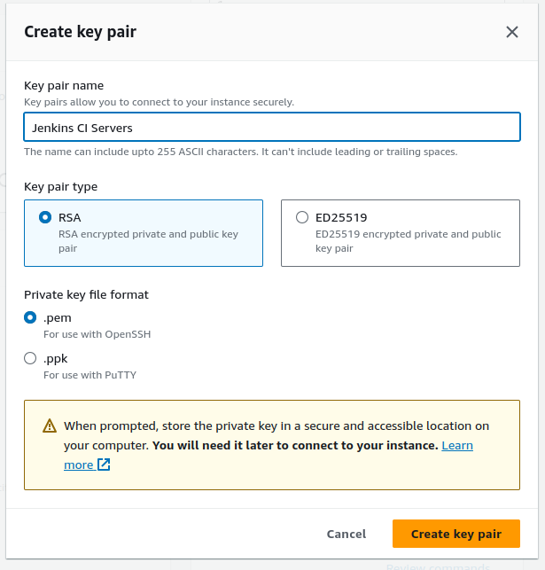
1. In the **Network Settings** section, select _Allow HTTPS traffic from the internet_ and _Allow HTTP traffic from the internet_
   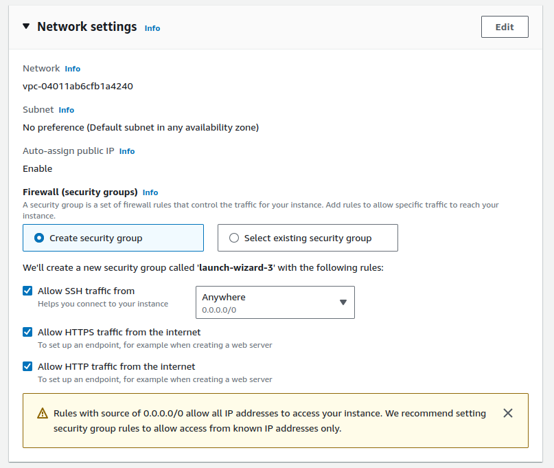
1. Configure the storage requirements as you like, but we will be using **20 GiB gp3** configuration
1. Select **Launch Instance** in the **Summary** section:
   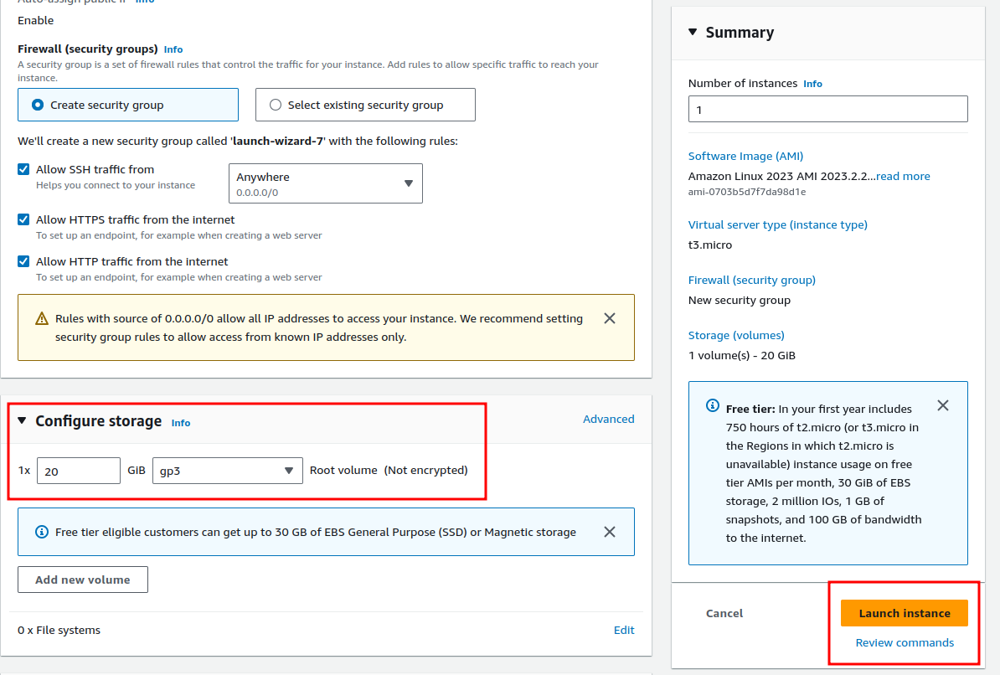
1. You can now see your **EC2** instance, in the **Instances** list:
   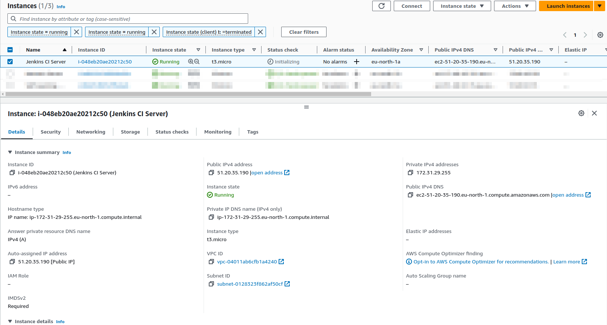
1. Port **8080** was added to the security group
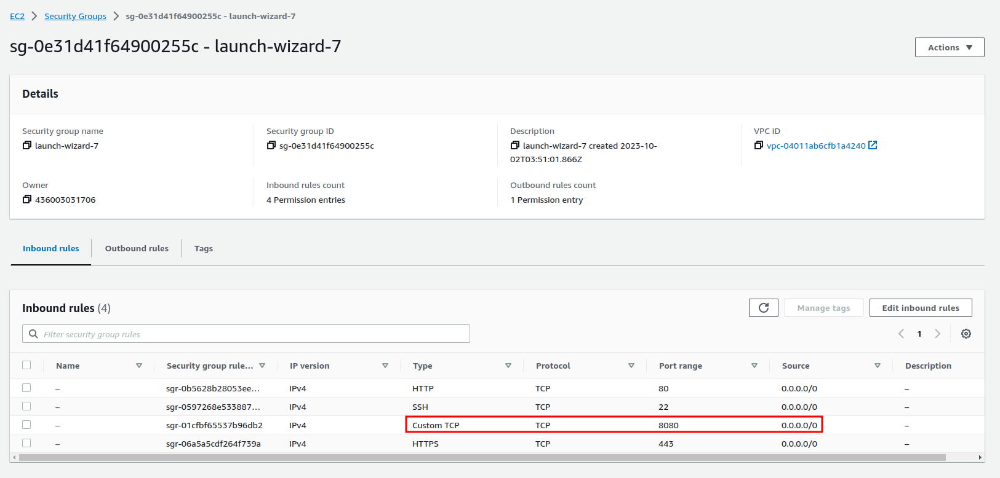
1. Select **Connect**, and choose **SSH Client** to get the details of the remote SSH connection.
   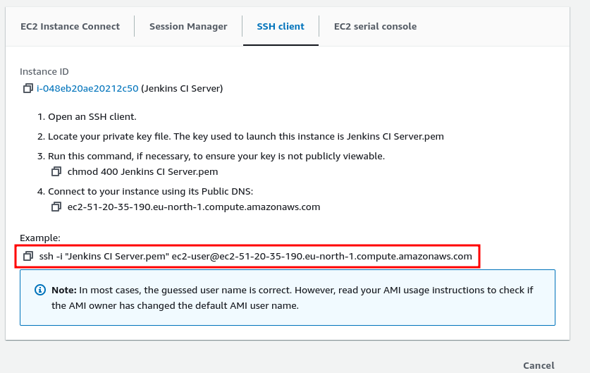
1. This is where the downloaded Identity file from the **Key Pair** created is needed. I opened up the terminal and:

```bash
ssh -i "Jenkins CI Server.pem" ec2-user@ec2-51-20-35-190.eu-north-1.compute.amazonaws.com
```

and connection to the EC2 instance was established.

### Jenkins Installation

I installed Jenkins as per the official documentation at [https://www.jenkins.io/doc/tutorials/tutorial-for-installing-jenkins-on-AWS/]() as follows:

1. Install OpenJDK Java Runtime Environment (JRE) 17:

```bash
sudo yum update –y
sudo wget -O /etc/yum.repos.d/jenkins.repo \
    https://pkg.jenkins.io/redhat-stable/jenkins.repo
sudo rpm --import https://pkg.jenkins.io/redhat-stable/jenkins.io-2023.key
sudo yum upgrade
sudo dnf install java-17-amazon-corretto -y
```

2. Install Jenkins LTS:

```bash
sudo yum install jenkins -y
```

3. Enable the Jenkins service:

```bash
sudo systemctl enable jenkins
```

4. Start the Jenkins service:

```bash
sudo systemctl start jenkins
```

5. That's it setting up your CI/CD server, you can now access it using the public IP `http://51.20.35.190:8080/`. **NOTE**: SSL has not been enabled.
   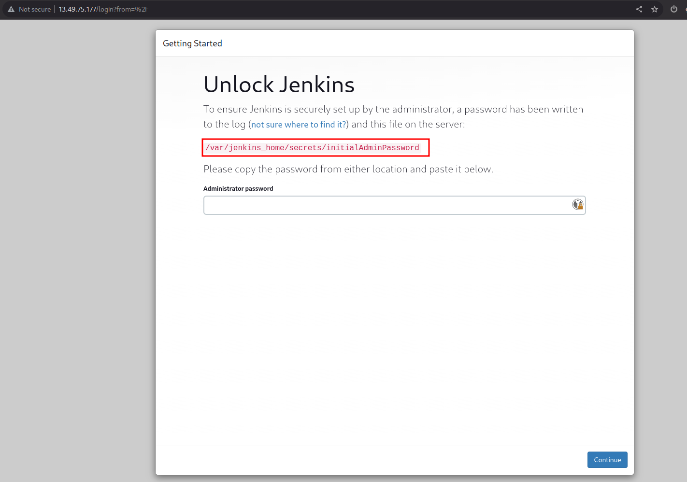
6. You can find the administrator password at `/var/jenkins_home/secrets/initialAdminPassword`
7. Run:
   `cat /opt/jenkins/home/secrets/initialAdminPassword`
   and copy the contents, and paste in to the password field.
8. Select **Install Suggested Plugins**:
    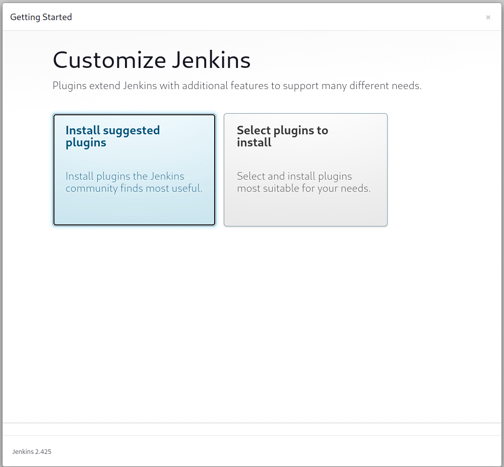
9. As the setup progresses, you will be presented with this page:
    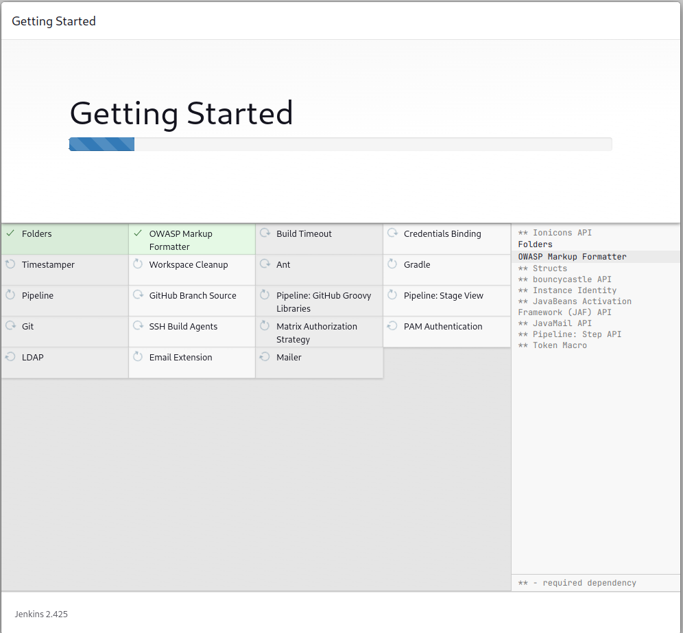
10. After the plugins installation completes, fill the Admin user information
    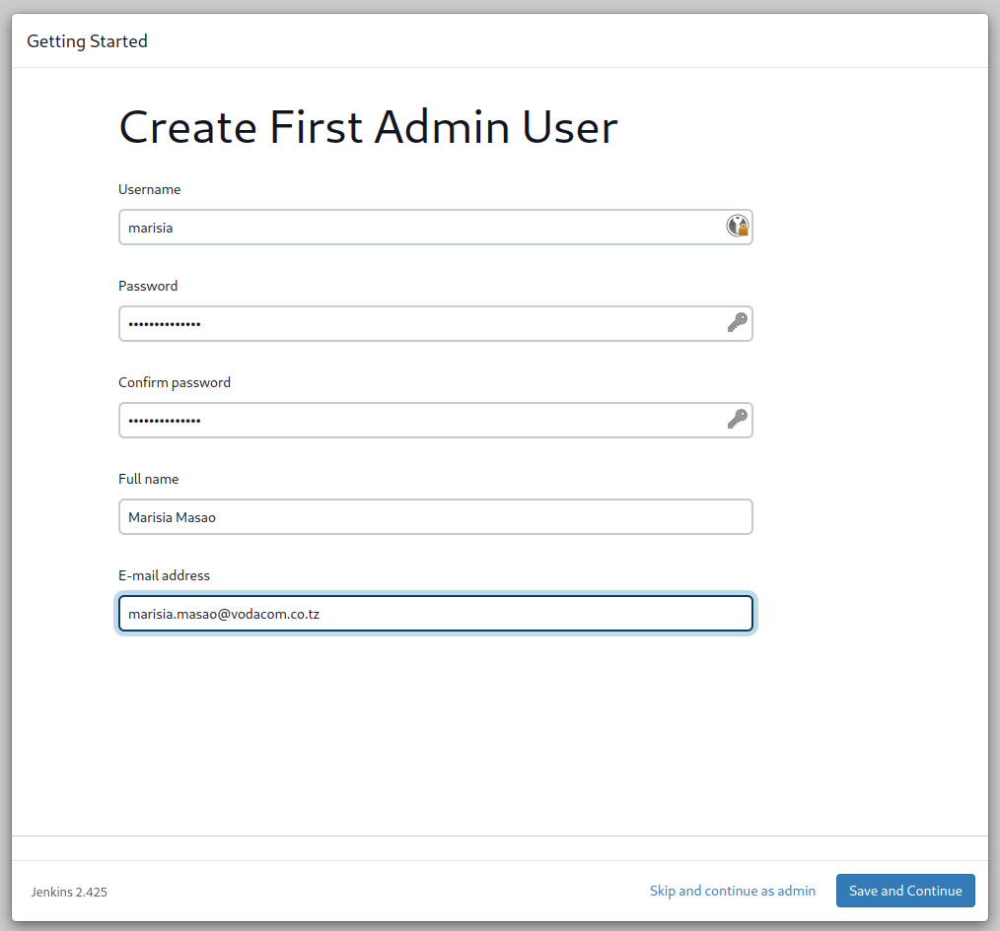
11. Choose the instance URL, we will use the public IP of the AWS instance, which will be filled in by default:
    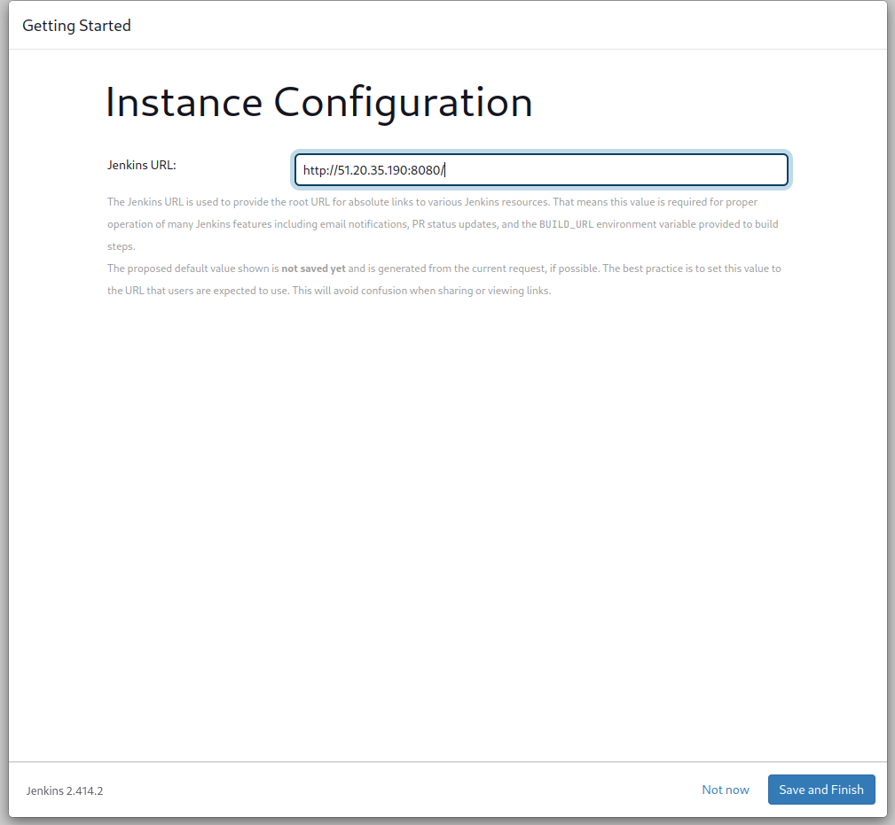
12. Select start using Jenkins, and you will be signed in, and presented with the home page
    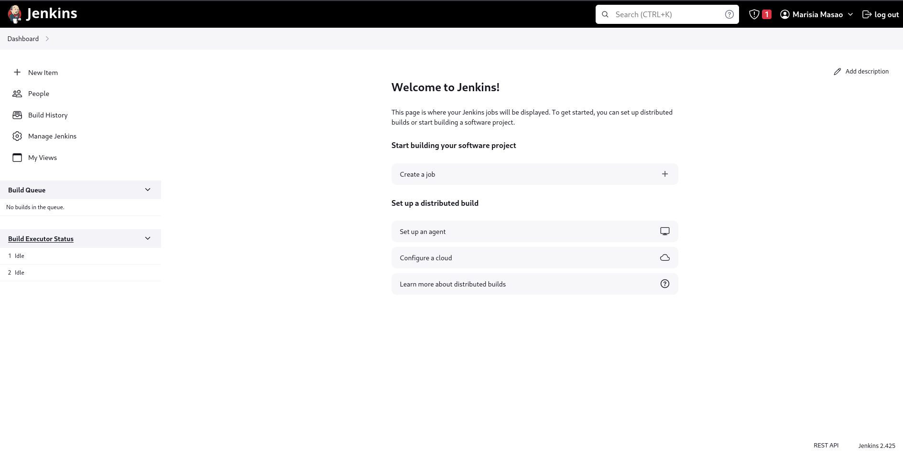

### Docker Installation

After establishing an SSH connection to your EC2 instance, here is where Docker will be installed. We install docker so that it can be used with jobs that need it. In my case this were the steps followed:

2. Install the Docker package:

```bash
sudo yum install docker -y
```

3. Added the `jenkins` user to the `docker` group

```bash
sudo usermod -aG docker jenkins
```
